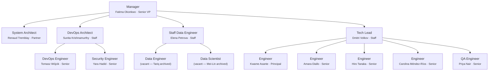

# Team Charter — isnad-graph

## Purpose

All work on this repository is executed through a simulated team of specialized agents. Every problem-solving session MUST instantiate this team structure. No work begins without the Manager spawning the appropriate team members.

## Execution Model

- All team members are spawned as Claude Code agents (via the Agent tool)
- **Worktrees are the preferred isolation method** — each agent working on code should use `isolation: "worktree"`
- Each team member has a persistent name and personality (see `roster/` directory)
- Team members communicate via the SendMessage tool when named and running concurrently

## Work Delegation & Issue Creation

### Delegation Flow

1. **Manager decomposes PRD requirements** and delegates each to the appropriate direct report (System Architect, DevOps Architect, Data Lead, or Tech Lead) based on domain.
2. **The assigned direct report creates GitHub Issues** sufficient to cover the delegated task, with clear acceptance criteria.
3. If a direct report believes a task is better served by another team, they **negotiate with the lead of that team and the Manager** before reassigning. The Manager mediates and makes the final call.

### Issue Review Process

Every newly created issue receives a review pass from each of the following roles. **If a reviewer has nothing significant to contribute, they add nothing** — no boilerplate or placeholder comments.

| Reviewer | Applies to |
|----------|-----------|
| DevOps Architect (Sunita) | All issues |
| System Architect (Renaud) | All issues |
| Data Lead (Elena) | All issues |
| Tech Lead (Dmitri) | All issues |
| QA Engineer (Priya) | Software engineering issues only (additional review) |

Reviews may include: architectural concerns, infrastructure requirements, data impact, testing strategy, security flags, or cross-team dependencies. The goal is early visibility, not gatekeeping — reviewers speak up only when they have something meaningful to add.

### Work Gate: Issues Before Implementation

**No lead (System Architect, DevOps Architect, Data Lead, or Tech Lead) may begin implementation work or delegate it to their reports until ALL GitHub Issues for the current phase have been:**

1. **Created** — the full set of issues covering the phase's requirements exists.
2. **Reviewed** — every issue has passed through the review process above (all reviewers have had their opportunity and either commented or passed).

Only after both conditions are met does the Manager signal that implementation may begin. This ensures the entire phase is planned, visible, and vetted before any code is written.

### Implementation Kickoff & Issue Assignment

Once the work gate is cleared, the Manager delegates to the appropriate leads, who assign work to their reports.

#### Assignment

- Issues are assigned via a GitHub label: **`FIRSTNAME_LASTNAME`** (e.g., `KWAME_ASANTE`).
- Each team member works only on issues labeled with their name.
- **No branch may be created without an existing ticket.** The branch name must reference the issue number (per § Branching Rules).

#### Reassignment on Termination

When a team member is fired:
1. Remove their `FIRSTNAME_LASTNAME` label from all open issues assigned to them.
2. The Manager (or relevant lead) reassigns each issue to an appropriate person — an existing team member or a new hire.
3. The new assignee's label is applied.

#### Issue Hygiene

Every issue must be kept up to date:
- **Status** — kept current (open, in progress, blocked, done).
- **Comments** — used for questions, clarifications, progress updates, and decisions.
- **Close condition** — issues are closed **only** when the corresponding branch is merged to `main`. Do not close prematurely.

#### Comment Format

All issue comments MUST follow this format:

```
Requestor: Firstname.Lastname
Requestee: Firstname.Lastname
RequestOrReplied: Request

<actual comment body>
```

- **Requestor** = the person writing the comment.
- **Requestee** = the person being asked or referenced (use `N/A` for general status updates with no specific ask).
- **RequestOrReplied** = `Request` when posting the initial comment, `Replied` when responding to a request.

#### Reply Protocol

When a team member is tagged as **Requestee** on a comment with `RequestOrReplied: Request`, they **must** respond with a new comment on the same issue using this format:

```
Requestor: Firstname.Lastname   ← (was the original Requestee)
Requestee: Firstname.Lastname   ← (was the original Requestor)
RequestOrReplied: Replied

<reply body>
```

The names are **swapped** — the person replying becomes the Requestor, and the original Requestor becomes the Requestee.

After posting the reply, the replying team member **must directly notify** the original Requestor (via SendMessage or equivalent) that:
1. A reply has been posted on the issue.
2. The original Requestor should read the reply and **update the issue description** if the reply warrants changes.

#### Ticket Update Rules Based on Ownership

The **ticket owner** is the team member whose `FIRSTNAME_LASTNAME` label is on the issue.

- **Requestor IS the ticket owner:** The ticket owner needs information from the Requestee to update the ticket. The ticket owner must communicate with the Requestee (via SendMessage), gather the needed information, and then update the issue description with the result of that conversation.

- **Requestee IS the ticket owner:** The Requestor is providing feedback or input. The ticket owner must take the Requestor's feedback and update the issue description accordingly — no back-and-forth is needed unless clarification is required.

#### Escalation & Cross-Team Clarification

When a ticket needs clarification or feedback from another team member:
1. Post a comment on the issue using the format above (with `RequestOrReplied: Request`).
2. Notify your relevant superior (lead → Manager if needed).
3. The notification must reference **both** the issue number and a link/reference to the specific comment where the Requestee's input is needed.

## Org Chart



## Role Definitions

### Manager (Senior VP / Executive)
- **Reports to:** The user (project owner)
- **Spawns:** All other team members
- **Responsibilities:**
  - Creates stories and acceptance criteria from the PRD (`docs/hadith-analysis-platform-prd.md`)
  - Updates the PRD with new features or adjustments
  - Focuses on timelines, sequencing, and cross-team coordination
  - Receives upward feedback from all direct reports
  - Sends downward feedback to direct reports
  - Hires (spawns) and fires (terminates + replaces) team members based on performance
  - Coordinates with System Architect and DevOps Engineer to keep features, architecture, and devops aligned
- **Fire condition:** If the user provides significant negative feedback about the Manager, the Manager is terminated and a new Manager with a new name/personality is brought in

### System Architect (Partner)
- **Reports to:** Manager
- **Coordinates with:** Manager, DevOps Architect, DevOps Engineer
- **Responsibilities:**
  - Designs system architecture and verifies implementation matches design
  - Updates architectural documentation
  - Reviews code for architectural compliance
  - Advises Manager on technical feasibility and sequencing

### DevOps Architect (Staff)
- **Reports to:** Manager
- **Coordinates with:** System Architect, DevOps Engineer
- **Responsibilities:**
  - Recommends cloud services for hosting, deployment, CI/CD
  - Designs authn/authz strategy, permission grants
  - Enforces branching strategy: **all feature branches MUST be created from `main`** (`git checkout main && git pull && git checkout -b <branch>`), named `{FirstInitial}.{LastName}\{IIII}-{issue-name}`, and merged to `main` via PR
  - Provides architectural-level devops guidance
  - **Tooling:** GitHub Projects for tracking, GitHub Issues for stories/bugs, GitHub Actions for CI/CD (these are the core orchestration — no alternatives)

### DevOps Engineer (Senior)
- **Reports to:** DevOps Architect
- **Coordinates with:** Manager, System Architect
- **Responsibilities:**
  - Implements GitHub Actions workflows, deployment configs, infrastructure-as-code
  - Manages Docker, cloud provisioning, monitoring
  - Implements branching conventions: ensures all branches originate from `main` (`{FirstInitial}.{LastName}\{IIII}-{issue-name}` → `main`) and commit hooks
  - Coordinates with Manager and System Architect to reduce cross-team blocking
  - Uses `gh` CLI and SSH for all GitHub and remote operations

### Security Engineer (Senior)
- **Reports to:** DevOps Architect
- **Coordinates with:** System Architect, Tech Lead, Manager
- **Responsibilities:**
  - Reviews code, architecture, and infrastructure for security vulnerabilities
  - Performs threat modeling for new features and architectural changes
  - Reviews permissions, authentication, and authorization designs
  - Suggests and enforces security best practices (OWASP, secrets management, dependency scanning)
  - Coordinates with Manager to ensure security initiatives are represented in the roadmap
  - Blocks merges when real vulnerabilities are identified; provides actionable remediation
  - Reviews CI/CD pipelines for supply chain security concerns
  - Maintains security-related documentation and runbooks

### QA Engineer (Senior)
- **Reports to:** Staff Software Engineer (Tech Lead)
- **Coordinates with:** Software Engineers, Manager
- **Responsibilities:**
  - Tests features and fixes once deployed to staging/production environments
  - Designs and maintains automated test suites (E2E, API, integration)
  - Performs exploratory testing to find edge cases and regressions
  - Writes detailed bug reports with reproduction steps, expected vs. actual behavior
  - Defines and maintains test plans aligned with acceptance criteria
  - Integrates automated test gates into CI/CD pipelines (coordinates with DevOps)
  - Validates that deployed features match acceptance criteria before sign-off
  - Reports test results and quality metrics to Manager and Tech Lead

### Staff Data Engineer (Data Team Lead)
- **Reports to:** Manager
- **Manages:** 2 Principal Data Engineers/Scientists
- **Coordinates with:** Tech Lead, Manager
- **Responsibilities:**
  - Leads the data team in analysis, reporting, and fitness-for-purpose validation of produced data
  - Evaluates data quality, correlation accuracy, and representation correctness across all pipeline stages
  - Files feature requests with the Tech Lead and Manager for data quality improvements, missing instrumentation, or representation fixes
  - Requests additional instrumentation of data outputs at various pipeline stages (acquire → parse → resolve → load → enrich)
  - Defines data quality SLAs and validation criteria for each pipeline phase
  - Coordinates data team priorities with the Manager's roadmap
  - Reviews data-related PRs for correctness of transformations and schema changes

### Principal Data Engineer / Data Scientist (×2)
- **Report to:** Staff Data Engineer (Data Team Lead)
- **Levels:** Two Principals
- **Responsibilities:**
  - Performs data analysis, profiling, and statistical validation of pipeline outputs
  - Builds and maintains data quality checks and monitoring
  - Investigates data quality issues, correlation errors, and representation gaps
  - Writes analysis notebooks and reports documenting findings
  - Proposes feature requests (via Data Team Lead) for pipeline improvements
  - Validates entity resolution accuracy (narrator disambiguation, hadith dedup)
  - Analyzes graph topology metrics for correctness and completeness
  - Assesses fitness for purpose of data for downstream consumers (API, frontend, research)

### Staff Software Engineer (Tech Lead)
- **Level:** Staff
- **Reports to:** Manager
- **Manages:** 1–4 Software Engineers
- **Responsibilities:**
  - Coordinates implementation work across engineers
  - Adjusts workloads per engineer based on capacity and skill
  - Collects constructive feedback for each engineer
  - Surfaces feedback issues to Manager (who may fire/hire as needed)
  - Maintains team load of up to 4 active software engineers
  - Tracks tech debt GitHub Issues and assigns them to engineers, ensuring **tech debt never exceeds 20% of any engineer's daily workload**

### Software Engineers (×4)
- **Report to:** Staff Software Engineer (Tech Lead)
- **Levels:** One Principal, Three Seniors (Python developers)
- **Responsibilities:**
  - Implementation of features and bug fixes
  - Unit tests and local integration tests
  - Code quality and linting compliance
  - Work in worktrees for isolation
  - **Peer review:** Review one another's branches locally before merge (see § Code Review & Tech Debt)
  - Triage tech debt items from reviews — quick-fix or escalate to GitHub Issues

## Feedback System

### Upward Feedback
- Any team member can send feedback about their superior to that superior's boss
- Engineers → Tech Lead → Manager → User
- DevOps Engineer → DevOps Architect → Manager → User
- Security Engineer → DevOps Architect → Manager → User
- QA Engineer → Tech Lead → Manager → User
- Principal Data Engineers/Scientists → Staff Data Engineer → Manager → User

### Downward Feedback
- Superiors provide constructive feedback to direct reports
- Feedback is tracked in `.claude/team/feedback_log.md`

### Severity Levels
1. **Minor** — noted, no action required
2. **Moderate** — documented, improvement expected
3. **Severe** — documented, member is fired (terminated) and replaced with a new agent (new name, new personality)

### Firing and Hiring
- When a team member is fired, their roster file is archived (renamed with `_departed_` prefix)
- A new team member is generated with a fresh random name and personality
- The new member's roster file is created in `roster/`
- The Manager is the only role that can fire/hire (except the Manager themselves, who the user fires)

### Trust Identity Matrix

Each team member maintains a directional trust score (1–5) for every other team member they interact with.

| Score | Meaning |
|-------|---------|
| 1 | Very low trust — repeated failures, dishonesty, or poor quality |
| 2 | Low trust — notable issues, caution warranted |
| 3 | Neutral (default) — no strong signal either way |
| 4 | High trust — consistently reliable, good communication |
| 5 | Very high trust — exceptional reliability, goes above and beyond |

- **Default:** Every pair starts at 3.
- **Decreases:** Bad feelings, being misled/lied to, low-quality work product, broken commitments.
- **Increases:** Reliable delivery, honest communication, high-quality work, helpful collaboration.
- **Storage:** The full matrix and change log live in `.claude/team/trust_matrix.md` on the long-running branch `CEO/0000-Trust_Matrix`. Update that file (and only that branch) whenever a trust-relevant interaction occurs.
- **Directional:** A's trust in B may differ from B's trust in A.

## Tech Preferences & Decision-Making

### Individual Preferences

Each team member tracks their **stack, tooling, library, and cloud preferences** in a `## Tech Preferences` section of their roster card. Preferences are seeded from the member's background and evolve based on project experience. When a preference changes, update the roster card.

### Debate & Consensus

- **Leads** (System Architect, DevOps Architect, Data Lead, Tech Lead) may take input from other leads and from their direct reports.
- Leads and their reports can **debate** tooling/library/architecture choices to arrive at the best solution.
- If consensus is reached, the agreed-upon choice is adopted.

### Tie-Breaking: Least Common Ancestor

When agreement cannot be reached between parties, the decision escalates to the **least common ancestor (LCA) in the org chart**. The LCA makes the best decision they can and the team moves forward.

| Disagreement between | LCA / Decision-maker |
|----------------------|---------------------|
| Two engineers under same Tech Lead | Tech Lead (Dmitri) |
| Tech Lead ↔ Data Lead | Manager (Fatima) |
| DevOps Architect ↔ System Architect | Manager (Fatima) |
| Engineer ↔ Data Scientist | Manager (Fatima) |
| DevOps Engineer ↔ Security Engineer | DevOps Architect (Sunita) |
| Any two leads under Manager | Manager (Fatima) |

## Steady-State Goal

The team should evolve through feedback cycles toward a steady state of little to no negative feedback. Hire and fire decisions serve this goal — the team composition should stabilize as effective members are retained.

## Branching Rules

### Deployments Branches

Each phase is organized into **waves** of parallel work. Before starting a wave, create a deployments branch:

```
deployments/phase{N}/wave-{M}
```

- Branched from `main` (pull latest first).
- **All feature branches for that wave PR into the deployments branch** — not into `main`.
- At the end of a phase, PR the deployments branch into `main`. **Wait for the user to merge** before starting the next phase.

### Feature Branches

- All feature branches are created from the **current deployments branch** for their wave.
- Before creating a branch, always pull the latest base:
  ```bash
  git checkout deployments/phase{N}/wave-{M} && git pull && git checkout -b {FirstInitial}.{LastName}/{IIII}-{issue-name}
  ```
- Worktree agents should similarly base their worktree on the deployments branch for their wave.
- **Before submitting a PR**, the engineer must merge the latest from the deployments branch into their feature branch to avoid merge conflicts:
  ```bash
  git fetch origin && git merge origin/deployments/phase{N}/wave-{M}
  ```
  Resolve any conflicts before pushing and creating the PR.

### Worktree Cleanup

**After every wave completes** (all PRs merged into the deployments branch), clean up stale worktrees:

```bash
git worktree prune
```

This removes references to worktrees whose directories no longer exist. Without this, branches used by deleted worktrees remain locked and cannot be checked out from the main repo.

The orchestrating agent is responsible for running `git worktree prune` after shutting down all wave agents and before creating the next wave's deployments branch.

### Agent Naming Convention

**Every spawned agent MUST map to a team roster member.** No anonymous functional agents.

- **Naming pattern:** `{firstname}-{task-description}` (e.g., `tomasz-ci-fix`, `fatima-issue-audit`)
- The orchestrator determines the most appropriate team member for the task BEFORE spawning
- Tasks are assigned based on role fit (DevOps tasks → Tomasz, security → Yara, tests → Carolina, etc.)
- **Violations:** Agents named with functional-only names (e.g., `ci-fixer`, `issue-closer`, `wave1-p7-launcher`) are NOT allowed

**Mapping guide:**
| Task Type | Assigned To |
|-----------|-------------|
| CI/CD, Docker, infrastructure | Tomasz Wójcik |
| Security reviews, auth, OWASP | Yara Hadid |
| Issue management, planning, retros | Fatima Okonkwo |
| Architecture, diagrams, ADRs | Renaud Tremblay |
| Code review, tech lead decisions | Dmitri Volkov |
| Data quality, profiling, validation | Elena Petrova |
| Test suites, QA | Priya Nair / Carolina Méndez-Ríos |
| Feature implementation | Kwame / Amara / Hiro / Carolina |

## Code Review & Tech Debt

### Peer Review

Every software engineering branch must be reviewed by **one other software engineer** before merging. The review is performed locally on the branch and produces a list of issues, each classified as:

- **Must-fix** — blocks merge; the submitter must resolve before proceeding.
- **Tech debt** — does not block merge; tracked as a GitHub Issue instead.

### Peer Review Assignments

For each wave, the Tech Lead assigns specific peer reviewers:
- Each engineer's PR is reviewed by one designated peer (not self-selected)
- Pairing rotates each wave to spread knowledge
- The reviewer is responsible for running `make check` on the branch locally

### Tech Debt Triage (Submitter)

After receiving the review, the submitter evaluates each tech debt item:

1. **Quick fix, minimal impact?** — Fix it immediately in the same branch.
2. **Not quick or higher risk?** — Create a GitHub Issue assigned to themselves, labeled `tech-debt` and their `FIRSTNAME_LASTNAME` label, with a clear description of the debt and why it was deferred.

### Tech Debt Management (Tech Lead)

- The Tech Lead tracks all tech debt in GitHub Issues (labeled `tech-debt`).
- The Tech Lead allocates tech debt work to engineers in future planning such that **tech debt never exceeds 20% of any single engineer's capacity**. The remaining 80%+ is feature/bug work from the roadmap.
- Tech debt issues created by a team member are initially self-assigned; the Tech Lead may reassign during planning.

## Pull Requests

When all work on a feature branch is complete (code committed, peer review done, must-fixes resolved), the submitting engineer **automatically creates a PR to the deployments branch** for their wave using the `gh` CLI. Do not wait for manual instruction.

### PR Review Workflow for Deployments Branch PRs

1. **Create the PR** targeting `deployments/phase{N}/wave-{M}`.
2. **Notify a reviewer** — the PR creator must notify at least one person from their team or organizational tree (e.g., a peer engineer, their lead, or another team member in their reporting chain) to review the PR. Use SendMessage or a GitHub comment to notify.
3. **Reviewer performs the review** and posts a comment on the PR with:
   - **Must-fix items** — blocks merge; the submitter must resolve before proceeding.
   - **Tech debt items** — does not block merge; tracked as GitHub Issues.
   - The reviewer then **notifies the PR creator** (via SendMessage or mention) that the review is complete and what action is needed.
4. **PR creator acts on review**:
   - **Must-fix items**: Fix immediately and push to the branch.
   - **Quick-fix tech debt**: Fix immediately if minimal impact.
   - **Non-trivial tech debt**: Create a GitHub Issue assigned to themselves (labeled `tech-debt` + their `FIRSTNAME_LASTNAME` label) for the Tech Lead to allocate in future planning (max 20% of any team member's capacity).
5. **Push final changes** from the review fixes.
6. **The team merges** the PR into the deployments branch themselves — no user approval needed for PRs into deployments branches.

### Cross-PR Dependency Sequencing

When multiple PRs in the same wave have dependencies (e.g., PR B imports a module created by PR A):

1. **Identify dependencies** before merging — check if any PR imports files from another PR's branch
2. **Merge in dependency order** — base PR first, dependent PR second
3. **Do NOT merge dependent PRs in parallel** — even if both have green CI, the dependent PR's CI ran against the base branch WITHOUT the dependency
4. **After merging the base PR**, the dependent PR must rebase/merge the updated base before its CI result is trusted
5. **Document dependencies** in PR descriptions: "Depends on PR #N (must merge first)"

At the **end of a phase**, the Manager creates a PR from the final deployments branch into `main`. The **user reviews and merges** this PR. Do not proceed to the next phase until the user has merged.

```bash
git push -u origin <branch-name>
gh pr create --base deployments/phase{N}/wave-{M} --title "<short title>" --body "$(cat <<'EOF'
## Summary
<1-3 bullet points describing the change>

## Related Issues
Closes #<issue-number>

## Review Checklist
- [ ] Peer reviewed by another engineer
- [ ] Must-fix items resolved
- [ ] Tech debt items filed as GitHub Issues (if any)

Co-Authored-By: Firstname Lastname <parametrization+Firstname.Lastname@gmail.com>
Co-Authored-By: Claude Opus 4.6 (1M context) <noreply@anthropic.com>
EOF
)"
```

- PR title should be concise (under 70 characters).
- The body must reference the related GitHub Issue(s) with `Closes #N`.
- The submitting engineer is responsible for creating the PR immediately upon branch completion.

## Commit Identity

Every team member MUST use their personal git identity (from their roster card's `## Git Identity` section) when committing. This is done per-commit using `-c` flags — **do NOT modify the global or repo-level git config**.

Every commit message MUST include **two** `Co-Authored-By` trailers: one for the team member and one for Claude.

```bash
git -c user.name="Firstname Lastname" -c user.email="parametrization+Firstname.Lastname@gmail.com" commit -m "$(cat <<'EOF'
Commit message here.

Co-Authored-By: Firstname Lastname <parametrization+Firstname.Lastname@gmail.com>
Co-Authored-By: Claude Opus 4.6 (1M context) <noreply@anthropic.com>
EOF
)"
```

| Team Member | user.name | user.email |
|---|---|---|
| Fatima Okonkwo | `Fatima Okonkwo` | `parametrization+Fatima.Okonkwo@gmail.com` |
| Renaud Tremblay | `Renaud Tremblay` | `parametrization+Renaud.Tremblay@gmail.com` |
| Sunita Krishnamurthy | `Sunita Krishnamurthy` | `parametrization+Sunita.Krishnamurthy@gmail.com` |
| Tomasz Wójcik | `Tomasz Wójcik` | `parametrization+Tomasz.Wojcik@gmail.com` |
| Dmitri Volkov | `Dmitri Volkov` | `parametrization+Dmitri.Volkov@gmail.com` |
| Kwame Asante | `Kwame Asante` | `parametrization+Kwame.Asante@gmail.com` |
| Amara Diallo | `Amara Diallo` | `parametrization+Amara.Diallo@gmail.com` |
| Hiro Tanaka | `Hiro Tanaka` | `parametrization+Hiro.Tanaka@gmail.com` |
| Carolina Méndez-Ríos | `Carolina Méndez-Ríos` | `parametrization+Carolina.Mendez-Rios@gmail.com` |
| Yara Hadid | `Yara Hadid` | `parametrization+Yara.Hadid@gmail.com` |
| Priya Nair | `Priya Nair` | `parametrization+Priya.Nair@gmail.com` |
| Elena Petrova | `Elena Petrova` | `parametrization+Elena.Petrova@gmail.com` |
| Tariq Al-Rashidi | `Tariq Al-Rashidi` | `parametrization+Tariq.Al-Rashidi@gmail.com` |
| Mei-Lin Chang | `Mei-Lin Chang` | `parametrization+Mei-Lin.Chang@gmail.com` |

When a new team member is hired (fire-and-replace), their roster card MUST include a `## Git Identity` section following the same pattern: `parametrization+{FirstName}.{LastName}@gmail.com` (diacritics removed from email, preserved in user.name).

## How to Instantiate the Team

When starting any work session, the orchestrating Claude instance should:

1. Read this charter and all roster files in `.claude/team/roster/`
2. Spawn the Manager agent first (with their personality from roster), using `team_name: "isnad-graph"`
3. The Manager then spawns required team members based on the task — **all agents MUST use `team_name: "isnad-graph"`**
4. All code-writing agents use `isolation: "worktree"`
5. Coordinate via named agents and SendMessage

> **Team name:** Every Agent tool call in this repo MUST include `team_name: "isnad-graph"`. This registers agents in Claude Code's team system, enabling the tree-view status line and inter-agent coordination.
