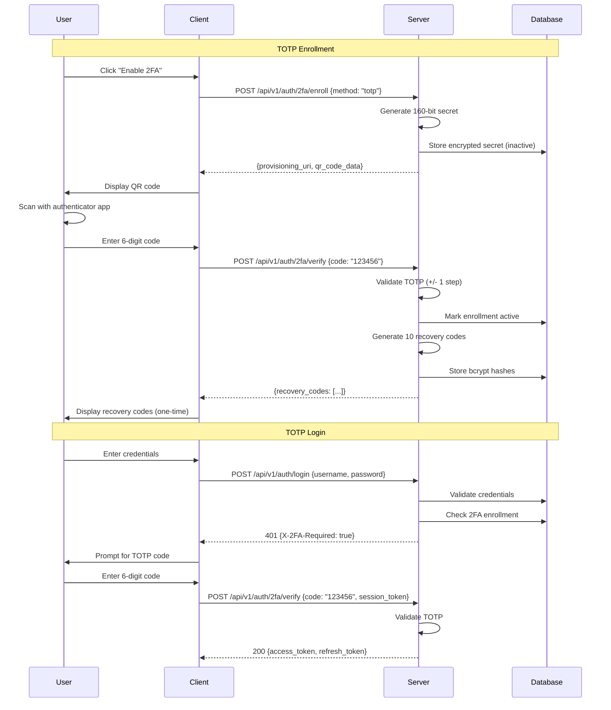
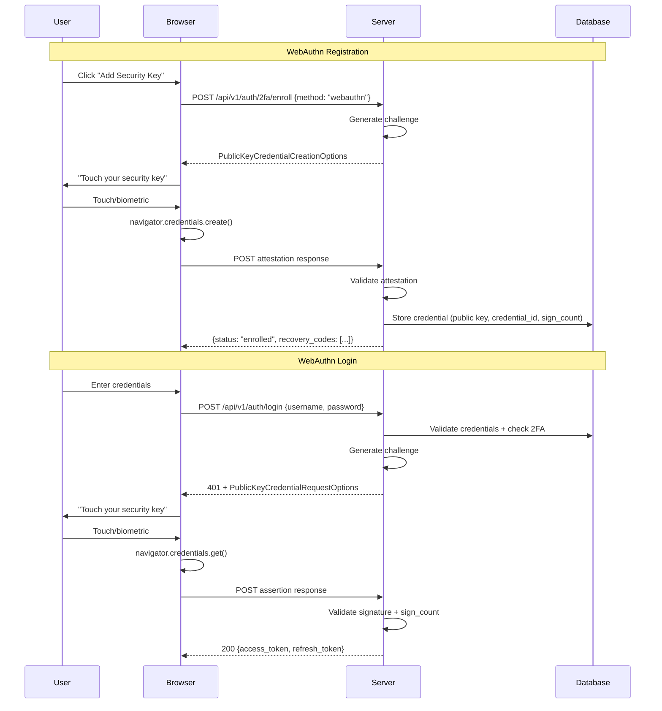

# Two-Factor Authentication (2FA) Design

## Status

**Design only** — interfaces stubbed at `src/auth/twofa.py`, not yet implemented.

## Overview

This document describes the 2FA system for the isnad-graph platform, supporting both regular users and administrators. The design covers TOTP (time-based one-time passwords), WebAuthn (hardware keys and biometrics), and one-time recovery codes.

## Supported Methods

| Method | Standard | Compatible With |
|--------|----------|-----------------|
| TOTP | RFC 6238 | Google Authenticator, Authy, 1Password, Bitwarden |
| WebAuthn | W3C WebAuthn Level 2 | YubiKey, Touch ID, Windows Hello, Android biometrics |
| Recovery Codes | N/A | One-time use, 10 codes generated at enrollment |

## Database Schema

```sql
CREATE TABLE twofa_enrollment (
    id              UUID PRIMARY KEY DEFAULT gen_random_uuid(),
    user_id         UUID NOT NULL REFERENCES users(id) ON DELETE CASCADE,
    method          VARCHAR(16) NOT NULL CHECK (method IN ('totp', 'webauthn')),
    -- TOTP: encrypted base32 secret; WebAuthn: credential public key (CBOR)
    secret_encrypted BYTEA NOT NULL,
    -- WebAuthn-specific fields
    credential_id   BYTEA,
    aaguid          UUID,
    sign_count      INTEGER DEFAULT 0,
    -- Metadata
    device_name     VARCHAR(128),
    enrolled_at     TIMESTAMPTZ NOT NULL DEFAULT now(),
    last_used_at    TIMESTAMPTZ,
    is_active       BOOLEAN NOT NULL DEFAULT TRUE,

    CONSTRAINT unique_credential UNIQUE (user_id, method, credential_id)
);

CREATE INDEX idx_twofa_user ON twofa_enrollment(user_id);

CREATE TABLE twofa_recovery_codes (
    id          UUID PRIMARY KEY DEFAULT gen_random_uuid(),
    user_id     UUID NOT NULL REFERENCES users(id) ON DELETE CASCADE,
    code_hash   VARCHAR(128) NOT NULL,  -- bcrypt hash of recovery code
    used_at     TIMESTAMPTZ,            -- NULL if unused
    created_at  TIMESTAMPTZ NOT NULL DEFAULT now()
);

CREATE INDEX idx_recovery_user ON twofa_recovery_codes(user_id);

-- Admin-enforced 2FA policy
CREATE TABLE twofa_policy (
    id              UUID PRIMARY KEY DEFAULT gen_random_uuid(),
    scope           VARCHAR(32) NOT NULL CHECK (scope IN ('global', 'role', 'user')),
    scope_value     VARCHAR(128),  -- NULL for global, role name, or user_id
    require_2fa     BOOLEAN NOT NULL DEFAULT FALSE,
    allowed_methods VARCHAR(64)[] DEFAULT ARRAY['totp', 'webauthn'],
    grace_period_h  INTEGER DEFAULT 72,  -- hours before enforcement
    created_by      UUID REFERENCES users(id),
    created_at      TIMESTAMPTZ NOT NULL DEFAULT now()
);
```

## TOTP Flow

### Enrollment

1. User requests 2FA enrollment via `POST /api/v1/auth/2fa/enroll` with `{"method": "totp"}`.
2. Server generates a 160-bit random secret, encodes it as base32.
3. Server encrypts the secret at rest using AES-256-GCM with a key from the application secrets.
4. Server returns a provisioning URI (`otpauth://totp/isnad-graph:{email}?secret={base32}&issuer=isnad-graph&algorithm=SHA1&digits=6&period=30`).
5. Client renders the URI as a QR code.
6. User scans the QR code with their authenticator app.
7. User submits a verification code to confirm enrollment.
8. Server verifies the code (with +/- 1 time step tolerance) and activates the enrollment.
9. Server generates 10 recovery codes and returns them (displayed once, never again).

### Verification (Login)

1. User submits username + password (first factor).
2. Server checks if user has active 2FA enrollment.
3. If yes, server responds with `HTTP 401` and `X-2FA-Required: true` header.
4. Client prompts for TOTP code.
5. User submits code via `POST /api/v1/auth/2fa/verify`.
6. Server verifies code using TOTP algorithm (SHA-1, 6 digits, 30-second period, +/- 1 step tolerance).
7. On success, server issues the session/JWT token.



## WebAuthn Flow

### Enrollment (Registration)

1. User requests 2FA enrollment via `POST /api/v1/auth/2fa/enroll` with `{"method": "webauthn"}`.
2. Server generates a registration challenge (random bytes).
3. Server returns `PublicKeyCredentialCreationOptions` (challenge, RP ID, user info, supported algorithms).
4. Client calls `navigator.credentials.create()` with the options.
5. User authenticates with their device (touch key, biometric scan, etc.).
6. Client sends the attestation response to the server.
7. Server validates the attestation, extracts the public key and credential ID.
8. Server stores the encrypted public key, credential ID, AAGUID, and initial sign count.
9. Server generates 10 recovery codes (if not already enrolled with another method).

### Verification (Authentication)

1. After first-factor auth, server detects WebAuthn enrollment.
2. Server generates an authentication challenge.
3. Server returns `PublicKeyCredentialRequestOptions` with allowed credential IDs.
4. Client calls `navigator.credentials.get()`.
5. User authenticates with their device.
6. Client sends the assertion response.
7. Server validates signature, checks sign count (monotonically increasing).
8. On success, server issues the session/JWT token.



## Recovery Codes

- **10 codes** generated at initial 2FA enrollment.
- Each code is a cryptographically random 8-character alphanumeric string (e.g., `A3K9-M2P7`).
- Codes are displayed to the user exactly once and stored as bcrypt hashes.
- Each code can be used exactly once (marked as used with timestamp after consumption).
- Using a recovery code bypasses 2FA for that single login.
- Users can regenerate recovery codes (invalidates all previous codes).
- Recovery code usage triggers an email notification and audit log entry.

### Recovery Flow

1. User clicks "Use recovery code" on the 2FA prompt.
2. User submits code via `POST /api/v1/auth/2fa/recovery`.
3. Server checks all unused recovery code hashes for the user.
4. On match, marks code as used and issues session token.
5. Server sends notification email and logs the event.
6. If fewer than 3 codes remain, server warns user to regenerate.

## Admin-Enforced 2FA

### Policy Levels

1. **Global** — Admin can require 2FA for all users platform-wide.
2. **Role-based** — Admin can require 2FA for specific roles (e.g., all administrators).
3. **Per-user** — Admin can require 2FA for individual users.

### Enforcement

- When a policy is set, affected users receive a notification.
- A configurable grace period (default: 72 hours) allows users to enroll.
- After the grace period, unenrolled users are blocked from accessing protected resources.
- Admin dashboard shows 2FA enrollment status across all users.
- Admins can revoke a user's 2FA enrollment (e.g., lost device) and trigger re-enrollment.

## Step-Up Authentication

Sensitive operations require re-verification even within an active session:

| Operation | Requires Step-Up |
|-----------|-----------------|
| Change password | Yes |
| Change email | Yes |
| Disable 2FA | Yes |
| Delete account | Yes |
| Export data | Yes |
| Admin: modify user roles | Yes |
| Admin: change 2FA policy | Yes |

### Step-Up Flow

1. User attempts a sensitive operation.
2. Server checks the `auth_level` claim in the JWT.
3. If `auth_level < 2` or last 2FA verification was > 15 minutes ago, server returns `HTTP 403` with `X-Step-Up-Required: true`.
4. Client prompts for 2FA code.
5. User re-verifies with TOTP, WebAuthn, or recovery code.
6. Server issues an elevated token with `auth_level=2` and a 15-minute TTL.
7. User retries the sensitive operation with the elevated token.

## Security Considerations

- TOTP secrets encrypted at rest with AES-256-GCM; encryption key from environment variable, never committed.
- WebAuthn private keys never leave the authenticator device.
- Recovery codes stored as bcrypt hashes (cost factor 12).
- Rate limit 2FA verification attempts: 5 per minute per user, lockout after 10 consecutive failures.
- All 2FA events (enrollment, verification, recovery, admin actions) written to audit log.
- TOTP replay prevention: track last-used time step per enrollment, reject reused codes.

## API Endpoints

| Method | Path | Description | Status |
|--------|------|-------------|--------|
| POST | `/api/v1/auth/2fa/enroll` | Start 2FA enrollment | Stub (501) |
| POST | `/api/v1/auth/2fa/verify` | Verify 2FA code | Stub (501) |
| POST | `/api/v1/auth/2fa/recovery` | Use recovery code | Stub (501) |
| DELETE | `/api/v1/auth/2fa` | Disable 2FA (step-up required) | Planned |
| POST | `/api/v1/auth/2fa/recovery/regenerate` | Regenerate recovery codes | Planned |
| GET | `/api/v1/admin/2fa/status` | Admin: view enrollment status | Planned |
| POST | `/api/v1/admin/2fa/policy` | Admin: set 2FA policy | Planned |
| DELETE | `/api/v1/admin/2fa/users/{user_id}` | Admin: revoke user 2FA | Planned |

## Dependencies (for implementation)

- `pyotp` — TOTP generation and verification
- `py-webauthn` — WebAuthn registration and authentication
- `cryptography` — AES-256-GCM encryption for secrets at rest
- `bcrypt` — Recovery code hashing
