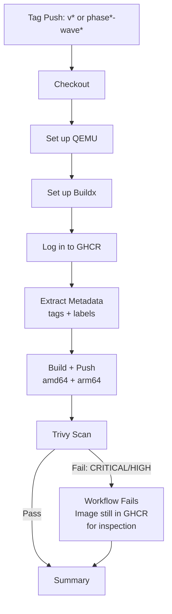

# GHCR Publish Workflow — Design Document

**Issue:** #530
**Author:** Sunita Krishnamurthy (DevOps Architect)
**Date:** 2026-03-29
**Status:** Design (gates Wave 1 implementation)

---

## Overview

This document describes the design for publishing container images to GitHub Container Registry (GHCR) via a GitHub Actions workflow. The workflow builds multi-architecture Docker images for the isnad-graph API service and publishes them to `ghcr.io/parametrization/isnad-graph`.

## Architecture Decisions

### 1. Single image: API only

The API service is the only custom-built image that changes frequently with code pushes. The other services in `docker-compose.prod.yml` use upstream images (Neo4j, PostgreSQL, Redis, Caddy, Prometheus, Grafana, etc.) or have stable custom builds (Neo4j with GDS plugin, frontend with Nginx). The frontend image will be added as a second published image in a future iteration once its release cadence is established.

### 2. GITHUB_TOKEN authentication (not PAT)

The workflow uses the built-in `GITHUB_TOKEN` secret for GHCR authentication. This is preferred because:

- No manual secret rotation required
- Permissions are scoped to the repository automatically
- Token is ephemeral (valid only for the workflow run)
- Works out of the box with `permissions: packages: write`

A Personal Access Token (PAT) would introduce a single point of failure (the token owner's account) and require manual rotation.

### 3. Multi-architecture builds (amd64 + arm64)

The workflow builds for both `linux/amd64` and `linux/arm64` using Docker Buildx with QEMU emulation. This ensures:

- Production deployment on Hetzner VPS (amd64) works directly
- Local development on Apple Silicon (arm64) uses native images instead of Rosetta emulation
- Future ARM-based hosting (e.g., Hetzner CAX instances) is supported without rebuild

### 4. BuildKit GHA cache (`type=gha`)

The workflow uses GitHub Actions cache as the BuildKit cache backend (`type=gha,mode=max`). This provides:

- Layer caching across workflow runs without a separate registry cache
- No additional infrastructure or cost (uses the repository's Actions cache quota)
- `mode=max` caches all layers, not just the final image layers, which maximizes cache hits for multi-stage builds

### 5. Image tagging strategy

Each push produces up to three tags:

| Tag | Example | Purpose |
|-----|---------|---------|
| Git tag | `v1.2.3`, `phase12-wave1` | Human-readable version identifier |
| Short SHA | `sha-a1b2c3d` | Precise commit traceability |
| `latest` | `latest` | Only on semver (`v*`) tags; convenient default pull |

The `latest` tag is only applied to semver tags (`v*`), not to `phase*-wave*` tags. This prevents internal milestone tags from becoming the default pull target.

### 6. SHA-pinned actions

All third-party actions are pinned by full commit SHA with a version comment:

```yaml
uses: actions/checkout@11bd71901bbe5b1630ceea73d27597364c9af683 # v4.2.2
```

This prevents supply-chain attacks where a tag is moved to point at malicious code. The comment preserves human readability.

### 7. Concurrency group

```yaml
concurrency:
  group: publish-${{ github.ref_name }}
  cancel-in-progress: false
```

- Groups by tag name to prevent parallel builds of the same tag
- `cancel-in-progress: false` ensures a build that started is never silently cancelled — if a tag is pushed while a previous build for a different tag is running, both complete
- Different tags run independently (each gets its own group)

### 8. Trivy vulnerability scanning

The workflow runs Trivy against the built image before the workflow completes. Configuration:

- **Severity:** CRITICAL and HIGH only (reduces noise from low/medium findings)
- **Exit code 1:** Fails the workflow if vulnerabilities are found
- **`ignore-unfixed: true`:** Suppresses findings with no available fix (e.g., upstream OS package vulnerabilities awaiting a patch)

The scan runs after the push step so that the image is available in GHCR for inspection even if Trivy finds issues. This is intentional — it allows the team to inspect the image and decide whether to roll back, rather than having no image to examine.

### 9. Trigger conditions

```yaml
on:
  push:
    tags:
      - "v*"           # semver releases (v1.0.0, v1.0.0-rc1)
      - "phase*-wave*" # milestone tags (phase12-wave1)
```

The workflow does **not** trigger on pushes to `main` or other branches. This keeps GHCR images tied to explicit release decisions, not every merge. The existing deploy workflow handles continuous deployment to the VPS on main pushes.

## Integration with Existing Deploy Workflow

### Current state (`deploy.yml`)

The deploy workflow currently:
1. SSHs into the Hetzner VPS
2. Runs `git pull` to get latest code
3. Runs `docker compose -f docker-compose.prod.yml up -d --build` to build and start services locally

### Future state (after GHCR integration)

Once GHCR publishing is stable, `deploy.yml` should be updated to pull pre-built images instead of building on the VPS:

```yaml
# In deploy.yml SSH script — replace the --build flag:
# Before:
docker compose -f docker-compose.prod.yml up -d --build --remove-orphans

# After:
docker compose -f docker-compose.prod.yml pull api
docker compose -f docker-compose.prod.yml up -d --remove-orphans
```

And in `docker-compose.prod.yml`, the `api` service changes from:

```yaml
api:
  build: .
```

To:

```yaml
api:
  image: ghcr.io/parametrization/isnad-graph:latest
```

This decouples build from deploy, providing:
- **Faster deployments:** No build step on the VPS (pulling a pre-built image takes seconds)
- **Reproducible deployments:** The exact image that was scanned and tested is what runs in production
- **Reduced VPS load:** No Docker build consuming CPU/memory during deployment

The `build:` directive can be kept alongside `image:` for local development — Docker Compose uses `image:` when pulling and falls back to `build:` if the image is not found.

### Migration plan

1. **Phase 1 (this PR):** Add the publish workflow. Deploy continues to build locally.
2. **Phase 2 (Wave 1 implementation):** Update `docker-compose.prod.yml` to reference the GHCR image. Update `deploy.yml` to pull instead of build.
3. **Phase 3 (validation):** Run both paths in parallel for one release cycle to confirm equivalence.

## Rollback Strategy

GHCR retains all tagged images indefinitely (within the GitHub free tier storage limits). To roll back:

### Quick rollback (deploy a previous tag)

```bash
# On VPS or via deploy workflow:
docker compose -f docker-compose.prod.yml pull api
# Override the tag in the compose file or via environment variable:
IMAGE_TAG=v1.1.0 docker compose -f docker-compose.prod.yml up -d api
```

### Emergency rollback (rebuild from source)

If the GHCR image is suspect, the VPS still has the git repository. Temporarily restore the `build:` directive in `docker-compose.prod.yml` and deploy the known-good commit:

```bash
git checkout v1.1.0
docker compose -f docker-compose.prod.yml up -d --build api
```

### Image retention policy

- All semver-tagged images (`v*`) are retained indefinitely
- SHA-tagged images (`sha-*`) can be pruned periodically via the GitHub API or `gh` CLI
- The `latest` tag always points to the most recent semver release

## Workflow Diagram



## Open Questions

1. **Frontend image:** Should we publish the frontend Nginx image to GHCR as well? Current recommendation: defer to a separate issue once release cadence is clear.
2. **Image pruning automation:** Should we add a scheduled workflow to prune old SHA-tagged images? Recommend deferring until storage becomes a concern.
3. **Signing:** Should we sign images with Sigstore/cosign? Recommend adding in a future hardening pass.
